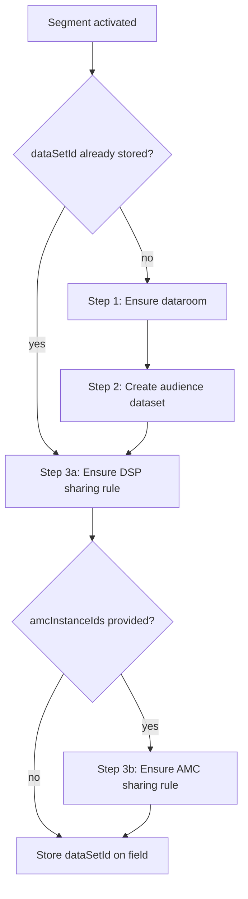

# Connector Spec — Amazon Data Manager (Advertiser Account)

Generic connector specification for the **AdvertiserAccountId** variant of the Amazon Data Manager (DM) API. Derived from the existing ManagerAccountId integration; all operations that used `ManagerAccountId` now use `AdvertiserAccountId` instead.

**API status:** Amazon is still developing this AdvertiserAccountId variant. This document describes the target contract and may need updates as Amazon publishes final API details.

---

## Summary block

```yaml
destination:
  slug: amazon-dm-advertiser
  display_name: Amazon Data Manager — Advertiser Account
  api_family: amazon_dm_advertiser
  streaming_algorithm: AMAZON_DM_ADVERTISER

# Primary account — mandatory everywhere ManagerAccountId was used
advertiser_account_id: "<user-selected AdvertiserAccountId>"

oauth:
  type: authorization_code + refresh_token
  seat_id: "<advertiser_account_id>"
  validation_api: POST /adm/datarooms
  metadata_keys: [clientId]

taxonomy:
  steps: [dataroom, dataset, dsp_sharing_rule, amc_sharing_rule_optional]
  segment_required: [name, countryCode, advertiserAccountIds]
  segment_optional: [description, idRetention, amcInstanceIds]

streaming:
  api_base_urls:
    NA: https://advertising-api.amazon.com
    EU: https://advertising-api-eu.amazon.com
    FE: https://advertising-api-fe.amazon.com
  batch_size: 10000
  identifier_types: [LIVERAMP_ID, MAID]
```

---

## 1. Identity and scope

| Field | Value |
|-------|-------|
| **Display name** | Amazon Data Manager — Advertiser Account |
| **Slug** | `amazon-dm-advertiser` |
| **API family** | `amazon_dm_advertiser` |
| **Streaming algorithm** | `AMAZON_DM_ADVERTISER` |

### Capabilities

Same three capabilities as the Manager connector:

1. **OAuth integration** — per-customer authorization to Amazon for segment activation
2. **Taxonomy / segment creation** — dataset → dataroom → sharing rules against the DM API
3. **Audience membership delivery** — add/remove members on an existing dataset

### Business summary

Advertiser-scoped DM API integration. There is **no ManagerAccountId** anywhere in this connector. The user-selected **AdvertiserAccountId** is the sole primary account identifier for OAuth, taxonomy, and ingestion. DSP sharing is always required; AMC sharing is optional and only after the DSP sharing rule exists.

### Delta from Manager connector

| Aspect | Manager connector | Advertiser connector |
|--------|-------------------|----------------------|
| Primary account property | `manager_account_id` | `advertiser_account_id` |
| OAuth seat / validation ID | ManagerAccountId | AdvertiserAccountId |
| Primary API header | `Amazon-Ads-Manager-Account-ID` | `Amazon-Ads-Advertiser-Account-ID` (mandatory) |
| Ingestion account headers | `Amazon-Ads-Manager-Account-ID` + optional `Amazon-Ads-AccountId` | `Amazon-Ads-Advertiser-Account-ID` only |
| DSP sharing rule body | `destinationAccountId` = advertiserAccountId | Unchanged |
| AMC sharing rule body | `destinationAccountId` = amcInstanceId | Unchanged |
| API paths / JSON bodies | `/adm/*` | Same |
| OAuth flow | auth-code + refresh | Same (header change only) |
| Segment sharing rules | DSP and/or AMC (at least one) | **DSP always required**; AMC optional after DSP |
| Streaming algorithm | `AMAZON_DM_MANAGER` | `AMAZON_DM_ADVERTISER` |

---

## 2. UI requirements — AdvertiserAccountId selection

Connect / destination setup must collect and persist AdvertiserAccountId before any API work.

| Requirement | Detail |
|-------------|--------|
| **Mandatory field** | User must select or enter an **AdvertiserAccountId** before OAuth connect or segment activation. |
| **No ManagerAccountId** | UI must not expose or collect ManagerAccountId for this connector. |
| **OAuth connect** | AdvertiserAccountId is captured at integration setup and used as the OAuth seat ID for validation (`POST /adm/datarooms`). |
| **Segment activation** | Segment config must include `advertiserAccountIds` matching the integration’s AdvertiserAccountId (DSP sharing rule target). |
| **Optional AMC** | User may provide `amcInstanceIds` for AMC sharing. AMC is additive only **after** the DSP sharing rule is ensured. |
| **Validation** | Block activation if AdvertiserAccountId is missing. If AMC is requested without a resolvable AdvertiserAccountId / DSP path, show a clear error — AMC depends on DSP sharing rule creation. |

**Storage:** Persist `advertiser_account_id` on the integration connection (same role `manager_account_id` played in the Manager connector).

---

## 3. Configuration properties

### Integration / connection properties

| Property | Required | Used by | Notes |
|----------|----------|---------|-------|
| `oauth_integration_id` | Yes | OAuth, taxonomy, ingestion | Integer integration ID |
| `region` | Yes | All | `NA`, `EU`, or `FE` |
| `advertiser_account_id` | Yes | OAuth seat, taxonomy, ingestion header | Replaces `manager_account_id` |
| `amazon_client_id` | Yes (ingestion) | Ingestion | From OAuth token metadata (`clientId`) |
| `identifier_type` | Yes (ingestion) | Ingestion | `LIVERAMP_ID` or `MAID` |
| `operation_type` | Yes (ingestion) | Ingestion | ADD → `CREATE`, DELETE → `DELETE` |

### Segment JSON (taxonomy)

| Field | Required | Notes |
|-------|----------|-------|
| `name` | Yes | Audience dataset name |
| `countryCode` | Yes | Must be a supported marketplace country (see Appendix B) |
| `advertiserAccountIds` | Yes | Exactly one ID; must match integration `advertiser_account_id`; DSP sharing rule target |
| `description` | No | Dataset / sharing metadata |
| `idRetention` | No | Default `true` |
| `amcInstanceIds` | No | Max one ID; AMC sharing rule target; only after DSP rule ensured |

**Sharing rule dependency:** AdvertiserAccountId is always mandatory. DSP sharing rule is always created. AMC sharing rule is optional and may only be created after the DSP sharing rule for the same dataset exists (or is confirmed via list). **No AMC-only segments.**

---

## 4. Base URLs

### DM API (regional)

| Region | Default base URL |
|--------|------------------|
| NA | `https://advertising-api.amazon.com` |
| EU | `https://advertising-api-eu.amazon.com` |
| FE | `https://advertising-api-fe.amazon.com` |

Regional DM API URLs may be overridden per deployment environment.

### OAuth auth (regional)

| Region | Auth base URL |
|--------|---------------|
| NA | `https://api.amazon.com/auth/o2` |
| EU | `https://api.amazon.co.uk/auth/o2` |
| FE | `https://api.amazon.co.jp/auth/o2` |

Token endpoint: `POST {auth_base}/token`

---

## 5. Shared headers (all DM API calls)

Every call to `/adm/*` includes:

| Header | Value |
|--------|-------|
| `Authorization` | `Bearer <access_token>` |
| `Amazon-Advertising-API-ClientId` | OAuth metadata `clientId` |
| `Amazon-Ads-Advertiser-Account-ID` | `<advertiser_account_id>` — **mandatory** |

**Content-Type:**

- Taxonomy endpoints: `application/json`
- Ingestion endpoint: `application/vnd.admAudiences.v1+json`

**Not used in this connector:** `Amazon-Ads-Manager-Account-ID`, `Amazon-Ads-AccountId`

---

## 6. OAuth validation

### 6.1 Flow overview

| Item | Value |
|------|-------|
| **Type** | Authorization code + refresh token |
| **Region** | From integration `region` |
| **Seat ID** | `advertiser_account_id` (user-selected at connect) |
| **Stored metadata** | `clientId` → sent as `Amazon-Advertising-API-ClientId` on all DM calls |

### 6.2 Token exchange

#### Initial token (after user authorizes)

| | |
|--|--|
| **Method** | `POST` |
| **URL** | `{auth_base}/token` |
| **Content-Type** | `application/x-www-form-urlencoded` |

**Body parameters:**

| Parameter | Value |
|-----------|-------|
| `grant_type` | `authorization_code` |
| `code` | Authorization code from redirect |
| `redirect_uri` | Registered redirect URI |
| `client_id` | OAuth app client ID |
| `client_secret` | OAuth app client secret |

**Response (typical):**

```json
{
  "access_token": "<token>",
  "refresh_token": "<refresh>",
  "expires_in": 3600,
  "token_type": "bearer"
}
```

#### Refresh token

| | |
|--|--|
| **Method** | `POST` |
| **URL** | `{auth_base}/token` |

**Body parameters:**

| Parameter | Value |
|-----------|-------|
| `grant_type` | `refresh_token` |
| `refresh_token` | Stored refresh token |
| `client_id` | OAuth app client ID |
| `client_secret` | OAuth app client secret |

### 6.3 Validation API

After token exchange, validate that the token works for the selected AdvertiserAccountId by ensuring a dataroom exists.

| | |
|--|--|
| **Purpose** | Confirm OAuth token + AdvertiserAccountId are valid for DM API |
| **Method** | `POST` |
| **Path** | `/adm/datarooms` |
| **Headers** | Shared headers (Section 5) |
| **Body** | `{}` |
| **Success** | HTTP **201** — dataroom created or already exists |
| **Failure** | Any error → validation failed |

**Retry behavior:**

- **401:** Refresh access token once, retry
- **429:** Backoff using `Retry-After` header (or default 2s), retry up to 5 times (idempotent call)

---

## 7. Taxonomy creation

Triggered when a segment targeting this destination is activated. Produces a `dataSetId` stored on the taxonomy field for downstream ingestion.

### 7.1 Flow overview



### 7.2 Step 0 — Reuse stored dataset (optional)

If the taxonomy field already has a stored `dataSetId` (`platform_integration_segment_id`), skip Steps 1 and 2. Proceed directly to sharing rules (Step 3).

### 7.3 Step 1 — Ensure dataroom

One dataroom per AdvertiserAccountId. Shared across all segments for that account in a batch — if dataroom creation fails, all fields in the batch without a stored `dataSetId` fail together.

#### Check dataroom exists

| | |
|--|--|
| **Method** | `GET` |
| **Path** | `/adm/datarooms` |
| **Headers** | Shared headers |
| **Success** | HTTP 200 — dataroom exists |
| **Not found** | HTTP 404 — proceed to create |

#### Create dataroom (idempotent)

| | |
|--|--|
| **Method** | `POST` |
| **Path** | `/adm/datarooms` |
| **Headers** | Shared headers |
| **Body** | `{}` |
| **Success** | HTTP **201** — new or existing dataroom |

**Response (typical):**

```json
{
  "dataroomId": "<id>"
}
```

### 7.4 Step 2 — Create audience dataset

#### List datasets (optional lookup)

| | |
|--|--|
| **Method** | `GET` |
| **Path** | `/adm/audiences` |
| **Query** | `limit=100`, `nextToken=<token>` (paginate until exhausted) |
| **Headers** | Shared headers |
| **Purpose** | Find existing dataset by `name` + `countryCode` before create |

Pagination behaves the same as under ManagerAccountId scope (`limit`, `nextToken`).

#### Create dataset

| | |
|--|--|
| **Method** | `POST` |
| **Path** | `/adm/audiences` |
| **Headers** | Shared headers |

**Request body:**

```json
{
  "name": "<segment.name>",
  "countryCode": "<segment.countryCode>",
  "description": "<segment.description>",
  "idRetention": true
}
```

| Field | Source | Notes |
|-------|--------|-------|
| `name` | Segment `name` | Required; unique per AdvertiserAccountId |
| `countryCode` | Segment `countryCode` | Required; see marketplace table |
| `description` | Segment `description` | Optional |
| `idRetention` | Segment `idRetention` | Default `true` if omitted |

**Success:** HTTP 201 with `dataSetId` in response body.

**Idempotency — DuplicateDatasetName (HTTP 400):**

```json
{
  "code": "DuplicateDatasetName",
  "datasetId": "<existing_dataSetId>"
}
```

Extract `datasetId` from the error body and continue — do not treat as failure.

**Retry:** 401 refresh once; 429 backoff/retry (max 5) for create.

### 7.5 Step 3 — Sharing rules

Before creating a sharing rule, check whether an active or pending rule already exists. **Do not retry sharing rule creation on 429** — existence is checked first instead.

#### 7.5.1 List existing sharing rules

| | |
|--|--|
| **Method** | `POST` |
| **Path** | `/adm/sharingRules/list` |
| **Headers** | Shared headers |

**Request body:**

```json
{
  "application": "DSP_AUDIENCES",
  "datasetIds": ["<dataSetId>"],
  "statuses": ["ACTIVE", "PENDING"],
  "destinationAccountId": "<advertiserAccountId or amcInstanceId>"
}
```

| Field | DSP lookup | AMC lookup |
|-------|------------|------------|
| `application` | `DSP_AUDIENCES` | `AMAZON_MARKETING_CLOUD` |
| `destinationAccountId` | Segment `advertiserAccountIds[0]` | Segment `amcInstanceIds[0]` |

If any matching rule is returned, skip create for that destination.

#### 7.5.2 Create DSP sharing rule (required)

Always executed for every segment.

| | |
|--|--|
| **Method** | `POST` |
| **Path** | `/adm/sharingRules` |
| **Headers** | Shared headers |

**Request body:**

```json
{
  "dataSetId": "<dataSetId>",
  "application": "DSP_AUDIENCES",
  "destinationAccountId": "<advertiserAccountId>",
  "marketplaceId": "<from countryCode>",
  "metadata": {
    "audienceMetadata": {
      "name": "<segment.name>",
      "displayName": "<segment.name>",
      "description": "<segment.description>"
    }
  }
}
```

| Field | Value |
|-------|-------|
| `destinationAccountId` | Segment `advertiserAccountIds[0]` — must match integration `advertiser_account_id` |
| `marketplaceId` | Derived from `countryCode` (Appendix B) |

#### 7.5.3 Create AMC sharing rule (optional)

Only when segment includes `amcInstanceIds`, **and** the DSP sharing rule for the same `dataSetId` has been ensured.

| | |
|--|--|
| **Method** | `POST` |
| **Path** | `/adm/sharingRules` |
| **Headers** | Shared headers |

**Request body:**

```json
{
  "dataSetId": "<dataSetId>",
  "application": "AMAZON_MARKETING_CLOUD",
  "destinationAccountId": "<amcInstanceId>",
  "marketplaceId": "<from countryCode>",
  "metadata": {
    "amcMetadata": {
      "amcInstanceId": "<amcInstanceId>",
      "amcInstanceName": null
    }
  }
}
```

### 7.6 Taxonomy output

On success, store `dataSetId` on the taxonomy field. This ID is used as the dataset target for audience ingestion.

---

## 8. Audience ingestion

Streams membership adds and removes to the dataset created during taxonomy sync.

### 8.1 Pipeline parameters

| Parameter | Value |
|-----------|-------|
| **Batch size** | Up to 10,000 members per API call |
| **Dataset ID** | `dataSetId` from taxonomy sync (stored on segment/field) |
| **Auth** | OAuth access token from customer integration |
| **Account header** | Integration `advertiser_account_id` |

### 8.2 Ingest members API

| | |
|--|--|
| **Method** | `POST` |
| **Path** | `/adm/audiences/{dataSetId}/members` |
| **Content-Type** | `application/vnd.admAudiences.v1+json` |
| **Headers** | `Authorization`, `Amazon-Advertising-API-ClientId`, `Amazon-Ads-Advertiser-Account-ID` |

**Path parameter:** `dataSetId` — from taxonomy result.

### 8.3 Request body

```json
{
  "members": [
    {
      "action": "CREATE",
      "externalUserId": "<transformed_id>",
      "userConsent": {
        "consent": {
          "amazonConsent": {
            "amznAdStorage": "GRANTED",
            "amznUserData": "GRANTED"
          }
        }
      },
      "userIdentity": {
        "externalIdentities": [
          { "liveRampId": "<id>" }
        ]
      }
    }
  ]
}
```

| Field | Values | Notes |
|-------|--------|-------|
| `action` | `CREATE`, `DELETE` | ADD operation → `CREATE`; DELETE operation → `DELETE` |
| `externalUserId` | Transformed identifier | Same value as identity field |
| `userConsent.consent.amazonConsent.amznAdStorage` | `GRANTED` | Fixed |
| `userConsent.consent.amazonConsent.amznUserData` | `GRANTED` | Fixed |
| `userIdentity.externalIdentities[].liveRampId` | ID value | When `identifier_type` = `LIVERAMP_ID` |
| `userIdentity.externalIdentities[].maId` | ID value | When `identifier_type` = `MAID` |

### 8.4 Response handling

**Success (no per-member errors):**

```json
{
  "ingressId": "<id>"
}
```

| Outcome | HTTP | Behavior |
|---------|------|----------|
| Full success | 2xx, empty `errors` | Accept; record `ingressId` |
| Partial failure | 2xx with `errors` array | Quarantine failed members; log each `errorCode` / `errorMessage` |
| Dataset not found | 404 | Mark `dataSetId` invalid; skip future calls for this dataset |
| Rate limited | 429 | Propagate for upstream retry |

**Example partial failure response:**

```json
{
  "ingressId": "<id>",
  "errors": [
    {
      "errorCode": "<code>",
      "errorMessage": "<message>"
    }
  ]
}
```

---

## 9. Error handling and retries

| Operation | 401 (refresh + retry) | 429 retry | Idempotency notes |
|-----------|----------------------|-----------|-------------------|
| `POST /adm/datarooms` | Yes (once) | Yes (max 5) | Duplicate returns 201 |
| `GET /adm/datarooms` | Yes | Yes | Read-only |
| `GET /adm/audiences` | Yes | Yes | Read-only; paginate with `nextToken` |
| `POST /adm/audiences` | Yes | Yes (max 5) | `DuplicateDatasetName` → reuse `datasetId` |
| `POST /adm/sharingRules/list` | Yes | Yes | Read-only |
| `POST /adm/sharingRules` | Yes | **No** | List first; do not replay on 429 |
| `POST /adm/audiences/{id}/members` | Yes (once) | Propagate | 404 → invalidate dataset |

---

## 10. Endpoint reference

| Method | Path | Purpose | Flow |
|--------|------|---------|------|
| `POST` | `{auth_base}/token` | OAuth token exchange / refresh | OAuth |
| `POST` | `/adm/datarooms` | Create dataroom (validation + taxonomy) | OAuth, Taxonomy |
| `GET` | `/adm/datarooms` | Check dataroom exists | Taxonomy |
| `GET` | `/adm/audiences` | List/search datasets | Taxonomy |
| `POST` | `/adm/audiences` | Create audience dataset | Taxonomy |
| `GET` | `/adm/audiences/{dataSetId}` | Verify dataset exists | Taxonomy |
| `POST` | `/adm/sharingRules/list` | Check sharing rule exists | Taxonomy |
| `POST` | `/adm/sharingRules` | Create DSP or AMC sharing rule | Taxonomy |
| `POST` | `/adm/audiences/{dataSetId}/members` | Add/remove audience members | Ingestion |

---

## Appendix A — Manager → Advertiser mapping

Use this table when diffing against the ManagerAccountId integration spec.

| Manager connector | Advertiser connector |
|-------------------|----------------------|
| `manager_account_id` property | `advertiser_account_id` |
| OAuth seat = ManagerAccountId | OAuth seat = AdvertiserAccountId |
| Header `Amazon-Ads-Manager-Account-ID` | Header `Amazon-Ads-Advertiser-Account-ID` |
| Header `Amazon-Ads-AccountId` (optional, ingestion) | **Removed** |
| Segment: at least one of DSP or AMC | Segment: **AdvertiserAccountId / DSP always required** |
| Segment: AMC-only allowed | **Not allowed** — AMC only after DSP rule |
| Algorithm `AMAZON_DM_MANAGER` | Algorithm `AMAZON_DM_ADVERTISER` |
| All `/adm/*` paths and JSON bodies | **Unchanged** |
| Sharing rule `application` values | **Unchanged** (`DSP_AUDIENCES`, `AMAZON_MARKETING_CLOUD`) |
| OAuth auth URLs and token exchange | **Unchanged** |
| Validation = `POST /adm/datarooms` | **Unchanged** (header only) |

---

## Appendix B — Country to marketplace ID

Required for sharing rule `marketplaceId` (derived from segment `countryCode`).

| Country code | Marketplace ID |
|--------------|----------------|
| AE | `A2VIGQ35RCS4UG` |
| AU | `A39IBJ37TRP1C6` |
| BR | `A2Q3Y263D00KWC` |
| CA | `A2EUQ1WTGCTBG2` |
| DE | `A1PA6795UKMFR9` |
| ES | `A1RKKUPIHCS9HS` |
| FR | `A13V1IB3VIYZZH` |
| IT | `APJ6JRA9NG5V4` |
| JP | `A1VC38T7YXB528` |
| MX | `A1AM78C64UM0Y8` |
| NL | `A1805IZSGTT6HS` |
| SA | `A17E79C6D8DWNP` |
| SE | `A2NODRKZP88ZB9` |
| TR | `A33AVAJ2PDY3EV` |
| UK | `A1F83G8C2ARO7P` |
| US | `ATVPDKIKX0DER` |

---

## Appendix C — Notes, constraints, and TBDs

### Resolved constraints

1. **API maturity:** Amazon is still developing the AdvertiserAccountId variant. Track Amazon documentation for header names, error codes, and edge-case changes.
2. **UI:** AdvertiserAccountId selection is mandatory at integration setup (Section 2). It drives OAuth validation, all API headers, and the mandatory DSP sharing rule.
3. **Mandatory AdvertiserAccountId; AMC depends on DSP:** No AMC-only segments. DSP sharing rule always created; AMC optional and only after DSP.
4. **Dataset list pagination:** `GET /adm/audiences` pagination is the same under AdvertiserAccountId as ManagerAccountId.
5. **Streaming algorithm:** `AMAZON_DM_ADVERTISER`.

### Remaining TBDs (track with Amazon)

- Final published confirmation of header name `Amazon-Ads-Advertiser-Account-ID` on all `/adm/*` endpoints
- OAuth app registration — same DM app or separate Advertiser-scoped app
- Advertiser-specific error codes or validation rules not yet documented

---

*Reference: ManagerAccountId integration overview (Amazon Data Manager API, Aug 2024). AdvertiserAccountId variant spec — hackathon connector work.*
